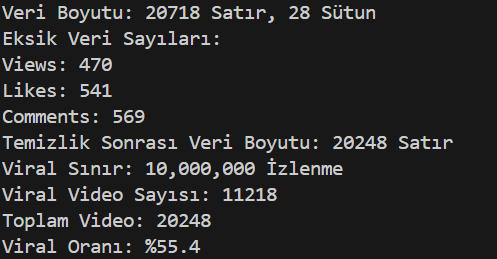
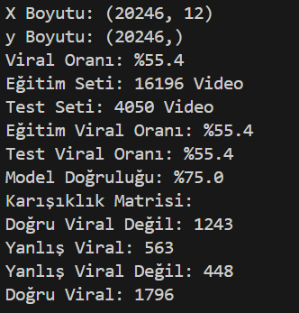
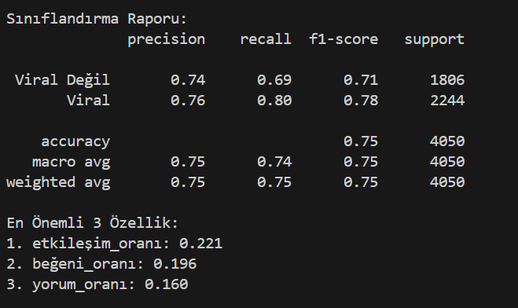
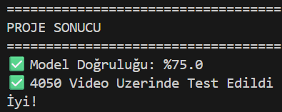

# YouTube Viral Tahmin Projesi

Bu proje, Spotify ve YouTube veri seti kullanılarak müzik parçalarının YouTube’da viral olup olmayacağını tahmin etmeyi amaçlamaktadır.
İlk olarak, veri setindeki küçük veri analizi çalışmalarını tamamladım. Ardından, bu analizlerden elde edilen bilgilerle kendi geliştirdiğim Random Forest Classifier modeli ile parçaların viral olma olasılıklarını tahmin ettim.

---

## Proje Dosya Yapısı

```
SpotifyYoutube_MLCASE/
│
├── Spotify Youtube Dataset.csv # Veri Seti
├── AboutDataset.txt # Veri Setinin Detaylı Açıklaması
├── SpotifyYoutube_MLCase.ipynb # Yönergedeki Soruların Çözümleri ve EDA Adımları
├── Model.ipynb # Viral Tahmin Modeli-Random Forest Modeli
├── Model2.py # Viral Tahmin Modeli-Geliştirilmiş Random Forest Modeli
├── Model2.2.ipynb # Model2'in Görsellerle Geliştirilmiş Versiyonu
├── README.md # Proje Açıklamaları
└── Outputs/ # Kod Çıktıları Ekran Görüntüleri
    ├── Output1.png # EDA Adımları ve Sonuçları
    ├── Output2.png # Eğitim ve Test Verileri Hakkında
    ├── Output3.png # Sınıflandırma Raporu
    └── Output4.png # Projenin Sonucu
```

---

## Proje Açıklaması

### 1. Veri Analizi (EDA)
- Eksik veriler tespit edildi ve görselleştirildi.  
- Zaman serisi özellikleri (Yıl, Ay, Gün, Saat, Mevsim) eklendi.  
- Dağılımlar incelendi.  
- Feature Engineering işlemleri gerçekleştirildi.

> Veri setinin detaylı açıklaması ve proje kapsamında yanıtlanan sorular için: [AboutDataset.txt](./AboutDataset.txt)

### 2. Viral Tahmin Modelleri
- **Hedef Değişken:** `viral` (0/1) → Bir parçanın viral olup olmadığını ifade eder.
- **Viral Tanımı:** Views > 10 milyon ise 1, değilse 0.
- **Kullanılan Bağımsız Değişkenler:**  
  Likes, Comments, Stream, Danceability, Energy, Valence ve türetilmiş özellikler.
- **Model:** Random Forest Classifier  
- **Özellikler:** Feature Engineering ile YouTube ve Spotify verilerinden türetilmiş yeni özellikler  

---

## Model Çıktıları (Model2.py)

### Veri Seti Hakkında


### Modelin Eğitimi


### Modelin Performansı


### Projenin Sonucu


---

## Kullanılan Teknolojiler & Kütüphaneler
- Python 3.x  
- Pandas, NumPy  
- Matplotlib, Seaborn, Plotly  
- Scikit-learn (RandomForestClassifier)  
- Jupyter Notebook (.ipynb)  

---

## Referans
- Kullanılan Veri Seti: [Spotify YouTube Data - Kaggle](https://www.kaggle.com/datasets/rohitgrewal/spotify-youtube-data)  

